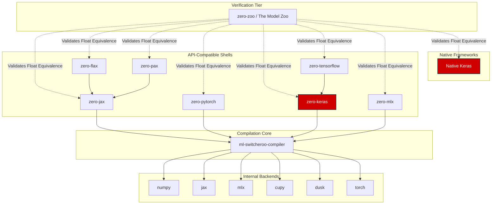

# Zero Framework API Shell

> **Note:** This repository is an API-compatible shell. All underlying math, autodiff, and graph execution has been migrated to the [ml-switcheroo-compiler](https://github.com/SamuelMarks/ml-switcheroo-compiler) backend. This repository purely implements frontend routing and syntactic parity for the target framework.

# [zero-keras](https://github.com/SamuelMarks/zero-keras)

## System Architecture & Purpose

**zero-keras** is a 1:1 API-compatible shell for the Keras framework. It exists to provide the exact same user-facing frontend API, abstractions, and syntactic sugar as native Keras, but it routes all underlying mathematical operations, automatic differentiation, and graph execution down to the unified [`ml-switcheroo-compiler`](https://github.com/SamuelMarks/ml-switcheroo-compiler) backend.

This architectural split allows developers to write standard Keras code while taking advantage of our compiler's multiple internal execution backends (`numpy`, `jax`, `mlx`, `cupy`, `dusk`, `torch`). 

To ensure absolute reliability, the [`zero-zoo`](https://github.com/SamuelMarks/zero-zoo) verification tier rigorously tests **zero-keras** against the native Keras implementation. It injects identical seeds and inputs into both frameworks and asserts float-for-float parity across complex model architectures during both forward and backward passes.

---

## License

Licensed under either of

- Apache License, Version 2.0 ([LICENSE-APACHE](LICENSE-APACHE) or <https://www.apache.org/licenses/LICENSE-2.0>)
- MIT license ([LICENSE-MIT](LICENSE-MIT) or <https://opensource.org/licenses/MIT>)

at your option.

### Contribution

Unless you explicitly state otherwise, any contribution intentionally submitted
for inclusion in the work by you, as defined in the [Apache-2.0 license](https://www.apache.org/licenses/LICENSE-2.0), shall be
dual licensed as above, without any additional terms or conditions.
